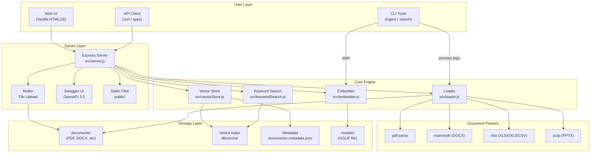
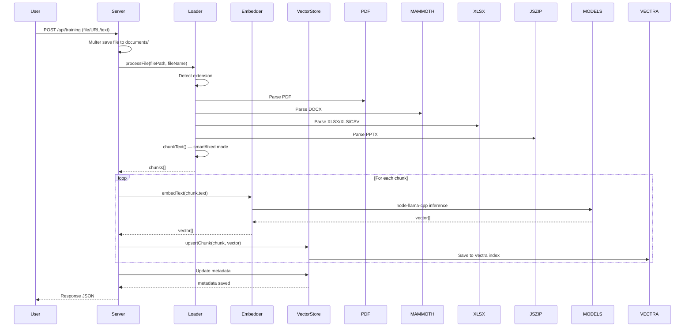
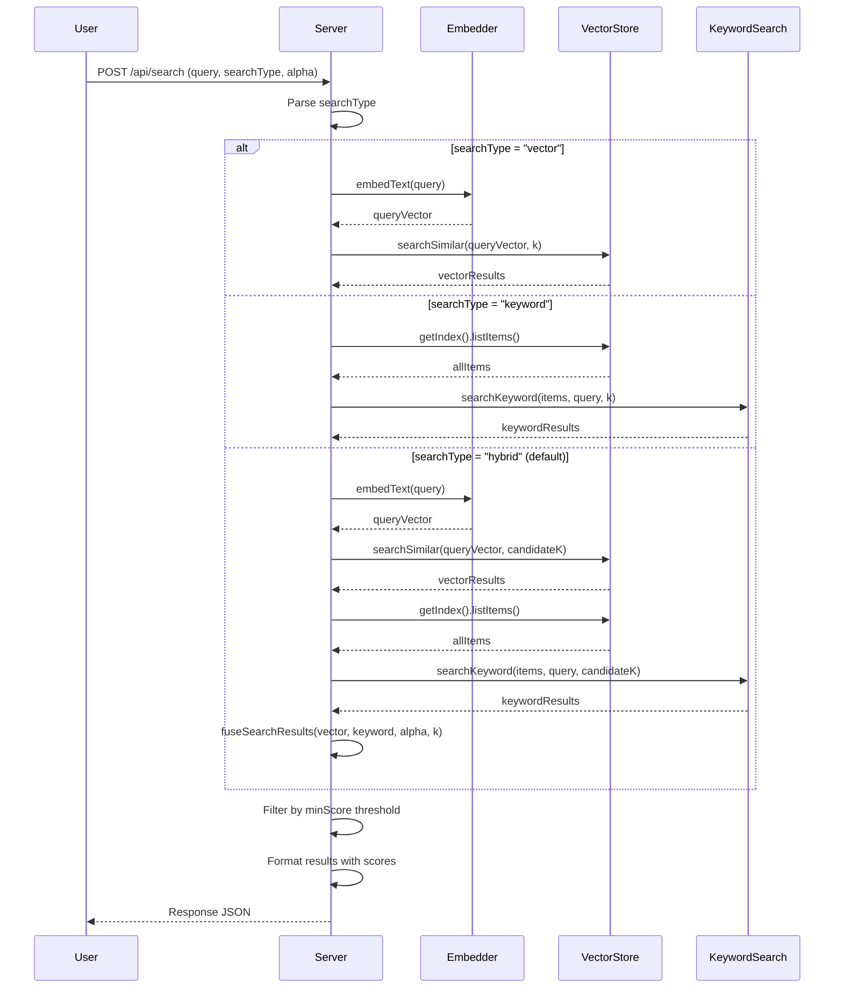
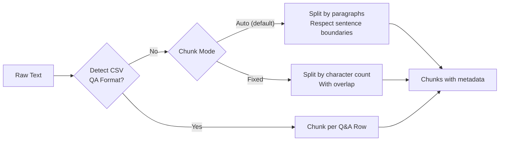
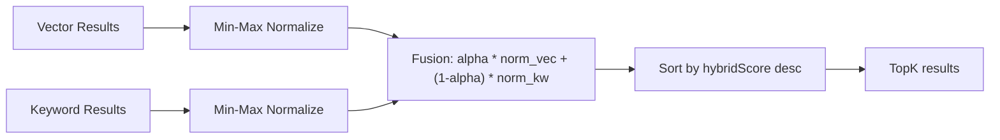

# Architecture — RAG Lokal Node.js

> Status: Draft
> Terakhir diperbarui: 2026-07-20
> Pemilik: Cloud Dark

## Diagram Komponen



## Alur Data — Upload & Indexing



## Alur Data — Search



## Alur Data — Chunking



## Format Dokumen: Pipeline Parsing

| Format | Parser | Ekstraksi | Keterangan |
|---|---|---|---|
| PDF | `pdf-parse` | Full text per halaman | Buffer-based |
| DOCX | `mammoth` | Paragraf via extractRawText | Buffer-based |
| XLSX/XLS | `xlsx` (SheetJS) | Semua sheet, baris jadi pipe-separated | readFile |
| CSV | `xlsx` | Sama seperti Excel | read(string) |
| PPTX | `jszip` | XML tiap slide, extract text | Buffer-based |
| TXT/MD | fs.readFileSync | UTF-8 langsung | File-based |

## Hybrid Search: Fusion Algorithm



Parameter default: alpha = 0.7, candidateK = max(k * 3, k), normalization = min-max.

## Struktur File

```
D:\project\local-rag\
├── .env                       ← Environment config
├── .gitignore
├── package.json
├── swagger.yaml               ← OpenAPI 3.0 spec
├── README.md
├── agent.md
├── test-search.js             ← Hybrid search test
│
├── documents/                 ← Upload & storage
│   └── .metadata.json         ← Document metadata (auto)
├── models/                    ← GGUF model files
│   └── *.gguf
├── db/vectra/                 ← Vectra index (auto)
│   └── index.json
│
├── public/
│   └── index.html             ← Web UI SPA
│
└── src/
    ├── config.js              ← Config from env
    ├── server.js              ← Express API entry point
    ├── loader.js              ← Parsing & chunking
    ├── embedder.js            ← GGUF embedding
    ├── vectorStore.js         ← Vectra wrapper
    ├── ingest.js              ← CLI batch indexing
    ├── search.js              ← CLI semantic search
    └── keywordSearch.js       ← BM25 algorithm
```

## Keputusan Arsitektur Kunci

1. **node-llama-cpp** untuk embedding lokal — zero API call, privasi penuh.
2. **Vectra** sebagai vector store — JSON-based, zero infrastructure.
3. **Hybrid search** sebagai default — kombinasi semantic + keyword.
4. **Smart chunking** — paragraph-aware, bukan fixed-size saja.
5. **Metadata JSON** — lightweight persistence tanpa DB terpisah.
6. **ES Modules** — `"type": "module"`, import/export syntax modern.

Lihat [11_DECISIONS.md](11_DECISIONS.md) untuk ADR detail.
